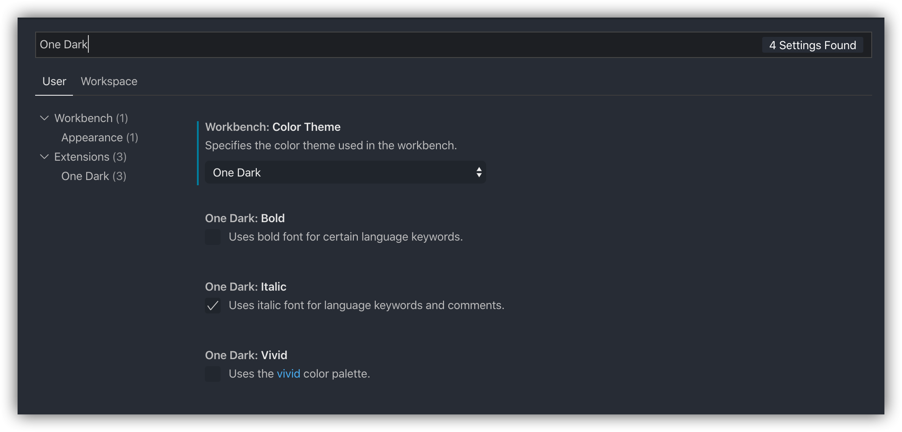

# VS Code One Dark Theme


[](https://marketplace.visualstudio.com/items?itemName=mskelton.one-dark-theme)
[](https://marketplace.visualstudio.com/items?itemName=mskelton.one-dark-theme)
[](#contributors)
[](https://github.com/semantic-release/semantic-release)

> [One Dark](https://github.com/atom/one-dark-syntax) theme for VS Code.


## Basic Configuration 🔧

This theme comes with several configuration settings to allow you to customize the theme to your preference. We currently support the following settings:

- **Vivid** - Uses the [One Dark Vivid](https://atom.io/themes/one-dark-vivid-syntax) color palette instead of the default color palette.
- **Italic** - When enabled, uses italic font for keywords. Note that some scopes \(i.e. markdown block quotes\) are styled with italic font even when this setting is disabled.
- **Italic attributes** - When enabled, uses italic font for HTML/JSX attributes. This does not depend on the italic setting being on or off.
- **Bold** - When enabled, uses bold font for namespace, class, and function names. Note that some scopes \(i.e. markdown headers\) are styled with bold font even when this setting is disabled.

To access these configuration settings, open the VS Code settings page and search for "One Dark".



This theme ships with the italic setting turned on by default and the other settings turned off by default, but you can adjust the settings to any combination you like. After updating the settings, you will be prompted to reload the window to apply the configuration changes.


## Advanced Configuration 🧰

VS Code allows users to fully customize themes to their liking. If you wish to adjust the editor colors, use the `workbench.colorCustomizations` setting in your `settings.json` file. An example of this is shown below.

```json
"workbench.colorCustomizations": {
  "tab.activeBackground": "#282c34",
  "activityBar.background": "#282c34",
  "sideBar.background": "#282c34"
}
```

To customize the syntax highlighting, use the `editor.tokenColorCustomizations` setting. An example of this is shown below.

```json
"editor.tokenColorCustomizations": {
  "[One Dark]": {
    "textMateRules": [
      {
        "scope": ["source.python"],
        "settings": {
          "foreground": "#e06c75"
        }
      }
    ]
  }
}
```

For more information, see the official [theme color reference](https://code.visualstudio.com/docs/getstarted/theme-color-reference) or [color theme documentation](https://code.visualstudio.com/docs/getstarted/themes).

## Further Documentation 📖

Check out the [docs](https://one-dark.gitbook.io/vscode) for manual installation instructions, additional screenshots, and contributing guidelines.

- [Installation](https://one-dark.gitbook.io/vscode/installation)
- [Screenshots](https://one-dark.gitbook.io/vscode/screenshots)
- [Contributing](https://one-dark.gitbook.io/vscode/contributing)

## Thanks 🙏

- Thanks to [Binaryify](https://github.com/Binaryify) for his work on the theme this project was originally based on.
- Thanks to [VS Code Nebula Theme](https://github.com/eating-coleslaw/vscode-nebula-theme) for being a great example of how to build a VS Code theme using configuration settings.
- Thanks to GitBook for hosting the docs!

## Contributors ✨

Thanks goes to these wonderful people ([emoji key](https://allcontributors.org/docs/en/emoji-key)):

<!-- ALL-CONTRIBUTORS-LIST:START - Do not remove or modify this section -->
<!-- prettier-ignore-start -->
<!-- markdownlint-disable -->
<table>
  <tr>
    <td align="center"><a href="https://github.com/mskelton"><br /><sub><b>Mark Skelton</b></sub></a><br /><a href="https://github.com/one-dark/vscode-one-dark-theme/commits?author=mskelton" title="Code">💻</a> <a href="#question-mskelton" title="Answering Questions">💬</a> <a href="https://github.com/one-dark/vscode-one-dark-theme/commits?author=mskelton" title="Documentation">📖</a> <a href="#ideas-mskelton" title="Ideas, Planning, & Feedback">🤔</a> <a href="#design-mskelton" title="Design">🎨</a></td>
    <td align="center"><a href="https://github.com/hhquerybuilder"><br /><sub><b>hhquerybuilder</b></sub></a><br /><a href="#design-hhquerybuilder" title="Design">🎨</a></td>
  </tr>
</table>

<!-- markdownlint-enable -->
<!-- prettier-ignore-end -->

<!-- ALL-CONTRIBUTORS-LIST:END -->

This project follows the [all-contributors](https://github.com/all-contributors/all-contributors) specification. Contributions of any kind welcome!
